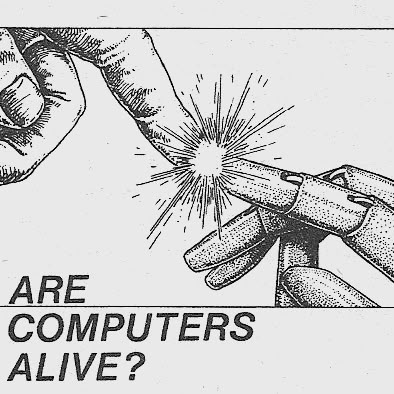

# AI Odyssey  
*Exploring the frontier of Artificial Intelligence.*

  

## Episodes

1. [What is AI?](./md/Introduction%20to%20Artificial%20Intelligence.md)

> _More episodes will appear as curiosity expands the horizon._

---

## Author
**NullSect**

## Tags
`#AI` `#Learning`

---

> *"The journey to understanding intelligence begins not with machines — but with asking what it means to think."*
