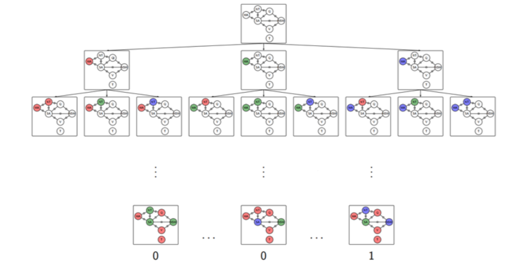

# **Constraint Satisfaction Techniques & Game AI Design**

**Constraint Satisfaction Techniques** are methods used to find solutions to problems defined by a set of **variables**, each with possible **values (domains)**, and a set of **constraints** that specify allowable combinations. These techniques systematically explore or reduce the search space to find valid assignments that satisfy all constraints.

**Constraint Satisfaction Techniques in Game AI Design** involve using **CSP methods** to help game agents make intelligent decisions under specific rules or limitations. These techniques represent problems as **variables**, **domains**, and **constraints** to efficiently find valid solutions.

Constraint Satisfaction Problems (CSPs) and Game AI, often taught together in Artificial Intelligence courses because both involve search, constraints, and reasoning.

## Table of Contents

- [**Constraint Satisfaction Techniques \& Game AI Design**](#constraint-satisfaction-techniques--game-ai-design)
  - [Table of Contents](#table-of-contents)
- [**Problem: Map Coloring**](#problem-map-coloring)
  - [**Solving Map Coloring using Search Trees**](#solving-map-coloring-using-search-trees)
  - [**Introducing Constraint Satisfaction Problems (CSPs)**](#introducing-constraint-satisfaction-problems-csps)
  - [**Backtracking Search**](#backtracking-search)
  - [**Heuristics in CSP**](#heuristics-in-csp)
    - [**Most Constrained Variable**](#most-constrained-variable)
    - [**LCV — Least Constraining Value**](#lcv--least-constraining-value)
  - [**Constraint Propagation?**](#constraint-propagation)
    - [**Forward Checking**](#forward-checking)
    - [**Arc Consistency**](#arc-consistency)
    - [**Forward Checking vs Arc Consistency**](#forward-checking-vs-arc-consistency)
  - [**Advantages of CSPs**](#advantages-of-csps)
- [**Adversarial Search Problem?**](#adversarial-search-problem)
  - [**Representing Games as Trees**](#representing-games-as-trees)
  - [**The MiniMax Algorithm**](#the-minimax-algorithm)
  - [**Alpha–Beta Pruning**](#alphabeta-pruning)

---

# **Problem: Map Coloring**

The **Map Coloring Problem** is a classical **AI and CSP example**.

**Description:**

* You must color each region of a map (e.g., Australia’s 7 states: WA, NT, SA, Q, NSW, V, T).
* **Constraint:** No two *neighboring regions* can have the **same color**.
* Usually, you have a small set of available colors (like Red, Green, and Blue).


**Goal:**

Find a coloring such that **all constraints are satisfied** — no two adjacent regions share the same color.


<br>

<br>
<br>


one possible solution can be:


<br>

<br>
<br>


## **Solving Map Coloring using Search Trees**

Before introducing CSPs, we can try solving this as a **state-space search** problem.

**How it works:**

* Each **state** = a partial assignment (e.g., WA = Red, NT = Green, SA = ?)
* The **goal test** = when all regions are colored and no constraints are violated.
* **Search method:** Depth-First Search (DFS).


lets take ther above colouring example


its possible solutions would be Using 3 colors: {Red, Green, Blue}


<br>

<br>
<br>

So total possible color assignments (paths, including wrong and right): `3^7=2187`

Valid colorings (no two adjacent regions share the same color): `18`

Invalid colorings : `2187−18=2169` 


**Problems with normal search:**

Even for just **7 nodes** and **3 colors**, we already explore **2187** possible paths.
As the number of nodes increases, the possibilities grow **exponentially** , becoming extremely large very fast.
This means the search algorithm wastes time checking many **invalid** colorings.
So for bigger graphs, this approach becomes **slow and inefficient**.

That’s why smarter techniques (like backtracking + constraint checking) are needed to reduce the search space.


* The algorithm treats each state as a **black box** (atomic, no structure).
* The search cannot “see” why a partial solution is invalid — it only checks at the end.
* It must generate and check **many useless states**, even when an early conflict exists (e.g., two adjacent states already share a color).

Thus, we need a **better representation** — where the algorithm *knows the constraints*.

---

## **Introducing Constraint Satisfaction Problems (CSPs)**

Before CSPs, solving map coloring using search trees is inefficient:

* The search algorithm treats each state as a **black box** — it cannot detect violations early.
* You cannot check if the state is valid until **all regions are colored**.
* Domain-specific logic is required to describe state transitions.
* Large search space → exponential growth → **wasted computation**.

So, instead of blindly exploring, CSPs allow us to **prune** invalid states early.


**What is a CSP?**

A **Constraint Satisfaction Problem (CSP)** is modeled as:

* **X (Variables):** `{X1, X2, ..., Xn}` 
* **D (Domains):** `{D1, D2, ..., Dn}` — possible values each variable can take
* **C (Constraints):** rules that specify allowed combinations of values


**CSP Applied to Map Coloring**

Example: Australia Map Coloring

* **Variables (X):**
  `{WA, NT, SA, Q, NSW, V, T}`

* **Domains (D):**
  `{R, G, B}` for each variable
  (Same for all variables in this problem)

* **Constraints (C):**
  Neighboring states must have **different** colors
  Example set:

  ```
  SA ≠ WA
  SA ≠ NT
  SA ≠ Q
  SA ≠ NSW
  SA ≠ V
  WA ≠ NT
  NT ≠ Q
  Q ≠ NSW
  NSW ≠ V
  ```

Formally, each constraint is written as a pair: `<Scope, Rel>`

where:

`Scope` = the set (or tuple) of variables that the constraint applies to.

Rel = the relation (set of allowed combinations of values**) those variables can take.

for example: 

Let’s take two neighboring regions:
SA (South Australia) and WA (Western Australia)

The rule is: `SA != WA`

so We can express it as:  `C1​=⟨(SA,WA),Rel⟩`

where `Rel={(R,G),(R,B),(G,R),(G,B),(B,R),(B,G)}`


That is, all pairs of colors where SA and WA are different.

**Why CSPs are better?**

* Constraints are checked as soon as a variable is assigned.
* Invalid branches are eliminated early → far fewer states explored.
* Same framework can solve:

  * Sudoku
  * N-Queens
  * Scheduling/timetabling
  * Teacher–course assignment

---

**CSP as a Constraint Graph**

A **Constraint Graph** visually represents the CSP:

* Each **node** = a variable (e.g., WA, NT, SA, etc.)
* Each **edge** = a binary constraint between two variables (e.g., WA ≠ NT)

This helps visualize relationships between variables.


<br>

<br>
<br>


Works perfectly when:

* Every constraint is binary (e.g. X ≠ Y)
* The relation can be represented as a simple link between two variables.


For more complex CSPs (like n-ary constraints), we can use a **Factor Graph**

A factor graph is used for `n-ary CSPs` , i.e., when constraints involve more than two variables.

where : 

* Circular nodes = variables
* Square nodes = constraints
* Edges connect each constraint to the variables it involves.

<br>

<br>
<br>


**Terminologies in CSPs**

| **Term**                    | **Meaning**                                                                                   | **Example in Australia Map**                             |
| --------------------------- | --------------------------------------------------------------------------------------------- | -------------------------------------------------------- |
| **Assignment**              | Giving a value to one or more variables                                                       | WA = Red, NT = Green                                     |
| **Complete Assignment**     | Every variable has a color assigned                                                           | WA=R, NT=G, SA=B, Q=R, NSW=G, V=B, T=R                   |
| **Partial Assignment**      | Only some variables have values                                                               | WA=R, NT=G (others uncolored)                            |
| **Consistent Assignment**   | No rule is violated so far                                                                    | WA=R, NT=G (OK, since WA≠NT)                             |
| **Inconsistent Assignment** | At least one rule is violated                                                                 | WA=R, SA=R (conflict, since adjacent)                    |
| **Solution**                | A **complete + consistent** assignment                                                        | All 7 regions colored and no two neighbors share a color |
| **Partial Solution**        | A **partial + consistent** assignment It’s not a full answer yet, but it’s on the right track | WA=R, NT=G, SA=B (so far no conflicts)                   |

---


## **Backtracking Search**

Backtracking search is the canonical *complete* algorithm for solving CSPs. It’s conceptually simple (depth-first search over assignments) but becomes effective in practice only when combined with *smart choices* and *constraint propagation*.

**High-level idea**

* Start with an empty assignment.
* Repeatedly pick an unassigned variable, assign it a value from its domain, check consistency; if consistent, recurse; if not, undo (backtrack) and try another value.
* If all variables are assigned and consistent → solution found.
* If you exhaust all options → no solution.

This is depth-first search on the **space of partial assignments**.


<br>

<br>
<br>


---


## **Heuristics in CSP**

**Why Heuristics Are Needed**

When solving a **Constraint Satisfaction Problem (CSP)** like *map coloring*, a simple **backtracking search** tries:

* Each variable,
* With every possible value,
* Checking constraints one by one.

That can explode combinatorially — even small problems can produce thousands of paths.

So, we introduce **heuristics** to make backtracking *smart*:

1. Pick **which variable** to assign next intelligently (MRV)
2. Pick **which value** to assign first wisely (LCV)

Together, they prune large useless parts of the search tree before exploring them.


### **Most Constrained Variable**

**Definition**

The **MRV heuristic** selects the **variable with the fewest legal values left** in its domain.

In simple words Pick the variable that is *most constrained*, i.e., has the least number of colors (values) it can still take.

**Intuition (Why it works)**

Suppose you’re coloring Australia’s map with 3 colors: {Red, Green, Blue}.

If one region (say SA) is surrounded by 5 neighbors, and due to their colors, SA can **only be Blue**,
while another region (say T) can be any of {R, G, B},
then **SA is the most constrained** — it’s about to fail if Blue doesn’t work.

By assigning SA **first**, we quickly detect if the problem is unsolvable at this stage, rather than wasting time coloring the rest first.

This follows the **fail-first principle**:

> Deal with the hardest (most restricted) variable first — so you fail early if necessary.


lets take an example with only Using 3 colors: {Red, Green, Blue}

<br>

<br>
<br>


so the the left most region has the most Constraint because it can only chose `Red` so we will assighn it colours from the rest


---
<br>
<br>


### **LCV — Least Constraining Value**

**Definition**

Once you’ve chosen *which variable* to color (using MRV), you need to decide **which color to try first**.

**LCV** = choose the **value that leaves the most options open** for the remaining variables.

**Intuition (Why it helps)**

You don’t just want a locally good choice — you want to **avoid making others impossible to color**.

So, you pick the color that **constrains the neighbors the least**.

> “Pick the value that causes the least trouble for your neighbors.”


lets take an example with an Domain having 3 colors: {Red, Green, Blue}

<br>

<br>
<br>

so if we chose `blue` here it will cause two neighbors to have same `Red/Green` colour so pick `Red` here as it will put the least constrains to the neighbors


---


## **Constraint Propagation?**

Constraint propagation is a **technique used in CSPs (Constraint Satisfaction Problems)** to **reduce the search space** before or during search.

It works by **enforcing logical consequences of constraints** — meaning if some variable assignments make others impossible, we detect that early and remove inconsistent options.

instead of blindly trying every possible combination, we can:

* **Remove impossible values early**
* **Detect dead-ends sooner**
* **Reduce backtracking**

**Two Major Types of Constraint Propagation**

### **Forward Checking**

**Idea:**

When we assign a value to one variable, we immediately look ahead to its neighbors (connected variables) and remove any values from their domains that conflict with this assignment.

**Example (Map Coloring):**
Suppose we color:

* `WA = Red`.

Then its neighbors (NT and SA) **cannot** be Red anymore.
So we remove “Red” from NT’s and SA’s domain.

**Effect:**

* We “check forward” from the assigned variable to future variables.
* If any neighbor ends up with **no legal values left**, we know there’s a **failure early** → we must **backtrack**.

**Limitation:**

* Forward checking only looks one step ahead — it doesn’t detect deeper consequences.
* Forward checking doesn't provide early detection for all failures...


<br>

<br>
<br>
<br>

because both `NT` & `SA` are neighbers and also have only `blue` in their domain so one will choose it and cause its neighbers to have no colour in their domain causing backtracking 

but `Arc Consistency` will predict it before and cause no backtracking

---


### **Arc Consistency**

**Idea:**

We make sure that **for every possible value of one variable (X)**, there exists **some compatible value in another variable (Y)**.

Formally,

> An arc (X → Y) is *consistent* if for every value `x` in X’s domain, there exists **at least one** value `y` in Y’s domain that doesn’t violate the constraint between X and Y.

**Example (Map Coloring):**

Suppose `SA` and `NT` must have different colors.

* `SA = {Red, Green}`
* `NT = {Red}`

Check arc `(NT → SA)`:

* NT = Red → is there some color in SA that’s different from Red? Yes, Green. ✅
  So it’s consistent.

But if `SA` had only `{Red}` —
Then there’s no valid SA color ≠ NT’s Red → arc is **inconsistent**, so we remove NT=Red.
If NT’s domain becomes empty → failure detected.

**Effect:**
Arc consistency looks **deeper** than forward checking — it ensures **mutual consistency** across all connected variables, not just immediate neighbors.

**Arc Consistency propagates changes beyond neighbors**

Here’s where people get confused — while the check is only between neighbors,
the effects of enforcing it can spread further.


<br>

<br>


here you can see that `Arc Consistency` can detect inConsistency the conflict betweeen `SA` and `NT`


---


### **Forward Checking vs Arc Consistency**


| **Aspect**                          | **Forward Checking (FC)**                                                                                                         | **Arc Consistency (AC)**                                                                                                                                 |
| ----------------------------------- | --------------------------------------------------------------------------------------------------------------------------------- | -------------------------------------------------------------------------------------------------------------------------------------------------------- |
| **Definition**                      | A local look-ahead method that eliminates inconsistent values **only from the immediate neighbors** of a newly assigned variable. | A global constraint propagation method that enforces consistency **in both directions** across all connected variable pairs (arcs).                      |
| **When it Works**                   | Applied **during search**, right after assigning a variable a value.                                                              | Can be applied **before or during search** to continuously maintain global consistency.                                                                  |
| **Propagation Direction**           | **One-way** — from the currently assigned variable to its **unassigned neighbors**.                                               | **Two-way** — each arc (X ↔ Y) must be consistent both directions. If one loses values, the other is rechecked.                                          |
| **Main Idea**                       | Once a variable is assigned, remove incompatible values from each neighboring variable’s domain.                                  | For every pair of connected variables (X, Y), ensure that for each `x ∈ Domain(X)`, there exists at least one `y ∈ Domain(Y)` satisfying the constraint. |
| **Scope of Consistency**            | **Local consistency**: checks only immediate neighbors of the last assigned variable.                                             | **Global consistency**: checks all pairs of connected variables (all arcs).                                                                              |
| **Detection of Failure**            | Detects inconsistency **only when a neighbor’s domain becomes empty**. Some failures may be detected late.                        | Detects failure **earlier** because it rechecks all arcs affected by pruning — even those not directly connected to the last assigned variable.          |
| **Efficiency**                      | Computationally cheaper because it prunes fewer values.                                                                           | More computationally expensive due to repeated rechecking of arcs.                                                                                       |
| **Completeness**                    | Less complete — it may miss some inconsistencies that only become apparent later.                                                 | More complete — detects more inconsistencies earlier (stronger propagation).                                                                             |
| **Used For**                        | A **lightweight** pruning step during backtracking to save time before branching further.                                         | A **powerful preprocessing** or ongoing propagation technique to reduce domains significantly before or during search.                                   |
| **Example (Map Coloring)**          | If WA = Red, forward checking removes “Red” from NT and SA’s domains.                                                             | Arc consistency then checks NT–SA, SA–Q, etc., ensuring all arcs remain consistent; if SA loses “Green,” it rechecks SA–Q to adjust Q’s domain too.      |
| **Consistency Enforced**            | **Forward consistency** (only one step ahead).                                                                                    | **Arc consistency** (both directions, across the entire network).                                                                                        |
| **Level of Constraint Propagation** | **Shallow propagation** — affects only direct neighbors.                                                                          | **Deep propagation** — effects spread across the constraint network.                                                                                     |
| **Algorithm Example**               | Usually combined with Backtracking search + MRV/LCV heuristics.                                                                   | Implemented via AC-3, AC-4, or other algorithms in CSP solvers.                                                                                          |
| **Speed vs Power Tradeoff**         | Faster, weaker pruning.                                                                                                           | Slower, stronger pruning.                                                                                                                                |
| **Typical Use Case**                | When quick checking is needed, or problem size is large.                                                                          | When early domain reduction greatly improves performance or when CSP has dense constraints.                                                              |


---


## **Advantages of CSPs**

1. Can represent **many different problems** (scheduling, puzzles, etc.).
2. Use **general-purpose solvers** — no need for problem-specific code.
3. **Prune large parts of the search space** using constraints.
4. Make **search more efficient** than simple state-space methods.

---


<br>
<br>
<br>


# **Adversarial Search Problem?**

In normal (single-agent) search problems like pathfinding or CSPs:

* You are **the only agent**.
* The environment is **static** (doesn’t change unless *you* change it).
* Your goal is to reach a **desired state** (like a solution or target).

Example:
Finding the shortest path in a maze — the maze doesn’t fight back!


**Now imagine there’s another player trying to stop you.**

* That’s an **adversarial** situation.
* You and the other player have **opposing goals**.

Such problems are modeled as **Adversarial Search Problems**.


**Real-World Examples**

| Type        | Example                                 | Goal Relationship     |
| ----------- | --------------------------------------- | --------------------- |
| Cooperative | Two agents delivering packages together | **Same goal**         |
| Adversarial | Chess, Go, Poker                        | **Conflicting goals** |

When agents compete — one tries to **maximize** their success, while the other tries to **minimize** it — that’s **adversarial search**.


**Why Games Are Used for Adversarial Search**

AI researchers use **games** like Chess, Go, and Poker because:

* Their **rules, states, and actions** are **clearly defined**.
* They are **perfectly observable** (both players can see the full board).
* They are **turn-based** — one move at a time.
* And they are **zero-sum** — one player’s gain is the other’s loss.

This makes them perfect for studying decision-making under competition.

**Key Game Properties**

| Property                | Meaning                                    | Example                                                    |
| ----------------------- | ------------------------------------------ | ---------------------------------------------------------- |
| **Deterministic**       | No randomness in the outcome of actions    | Chess: moving a piece always leads to a known new position |
| **Two-player**          | Only two competing agents                  | MAX vs MIN                                                 |
| **Turn-taking**         | Players alternate turns                    | One moves at a time                                        |
| **Perfect information** | Both players can see the entire game state | Chess board is fully visible                               |
| **Zero-sum**            | One player’s win = other player’s loss     | If MAX wins (+1), MIN loses (−1)                           |

There’s no “win-win” — it’s strictly **competitive**.


**Modeling a Game as a Search Problem**

Just like normal search problems, we describe a game using a set of **components**:

| Term                   | Meaning                                                                                       |
| ---------------------- | --------------------------------------------------------------------------------------------- |
| **S₀ (Initial State)** | The starting configuration of the game (e.g., empty tic-tac-toe board).                       |
| **TO-MOVE(s)**         | Whose turn it is to play in state *s* (MAX or MIN).                                           |
| **ACTIONS(s)**         | The set of legal moves available in state *s*.                                                |
| **RESULT(s, a)**       | The new state that results from taking action *a* in state *s*.                               |
| **IS-TERMINAL(s)**     | A test to check if the game has ended (win, lose, or draw).                                   |
| **UTILITY(s, p)**      | The numeric value of the terminal state for player *p* (e.g., +1 = win, 0 = draw, -1 = loss). |

---

<br>
<br>
<br>


## **Representing Games as Trees**

We use a **Game Tree** to represent all possible moves and outcomes.

Each node in the tree represents a **state of the game** (like the current board position), and each edge (branch) represents a **move**.

For example, in tic-tac-toe:

* The **root node** = initial empty board.
* Each **child node** = a possible move by X.
* Each **grandchild** = possible response by O.
* The process continues until the game ends (a **terminal state**).

**MAX and MIN Players**

We call the two players:

* **MAX** → the player trying to **maximize** the score (e.g., trying to win).
* **MIN** → the opponent trying to **minimize** MAX’s score (e.g., trying to make MAX lose).

These names don’t mean "good" or "bad" players — they just reflect their goals:

* MAX wants to **increase utility** (toward +1, meaning win).
* MIN wants to **decrease utility** (toward –1, meaning loss for MAX).

**Utility (Payoff) Function**

The **utility** or **payoff function** gives a numerical value for the outcome:

* +1 → MAX wins
* –1 → MIN wins
* 0 → Draw

So the utility is always from **MAX’s point of view**.
MIN automatically gets the opposite payoff (since it’s a zero-sum game).

---

## **The MiniMax Algorithm**

Now we come to the key part — **how to decide the best move**.

* **Explore all possible game states (like a search tree).**
* **Assign utility values to terminal (leaf) nodes — the game outcomes.**
* **Back up these values to earlier states (parents) using the following rules:**


* **At MIN nodes:** Choose the **minimum** of the children (MIN is trying to minimize MAX’s score).
* **At MAX nodes:** Choose the **maximum** of the children (MAX is trying to maximize his score).

This process continues up to the root node.
The value at the root is the **MiniMax value** of the game — it represents the best possible outcome for MAX if both play optimally.


MiniMax works in a **depth-first** way:

* Go down one full path to the terminal (leaf) state.
* Assign that leaf a utility value.
* **Backtrack** up the tree, updating the parent’s MiniMax value based on the rules:

  * If the parent is a **MIN node**, take the **minimum** of its children.
  * If it’s a **MAX node**, take the **maximum**.

This continues until you reach the **root** — that gives the final decision.

**When the Tree Is Complete**

Once every node has been evaluated:

* The **root node’s value** = best achievable outcome for MAX (assuming both play optimally).
* The **path from root to terminal** along the chosen moves = **optimal strategy** for MAX.

Every node along that optimal path will share the **same MiniMax value** as the root.


<br>

<br>
<br>
<br>


**Complexity**

If:

* **b** = branching factor (average number of moves per position)
* **m** = maximum depth of the game (number of moves until it ends)

Then the time complexity is: `O(b^m)`

Because in the worst case, MiniMax explores **every node** in the game tree.


* In **chess**, b ≈ 35 and m ≈ 80
  → total ≈ 35⁸⁰ ≈ 10¹²³ possible states (astronomically large!)

So it’s **impossible** to compute the full tree in practice — we must use **cutoffs** and **optimizations** like **Alpha-Beta pruning** (covered later).

---

<br>
<br>


## **Alpha–Beta Pruning**

Alpha–Beta is a **pruning method** applied to the Minimax search. It avoids exploring parts of the game tree that **cannot possibly** influence the final decision at the root. It does this by keeping two bounds as it searches:

* **α (alpha):** best (highest) value found so far for **MAX** along the path to the root.
* **β (beta):** best (lowest) value found so far for **MIN** along the path to the root.

If at any point we discover that a node cannot produce a value better than the current `α` or worse than the current `β`, we can **stop exploring** that node’s remaining children — a **cutoff**.


Minimax assumes both players play optimally. While searching a node, if you already have a guarantee (via α or β) that the opponent will avoid (or force) certain outcomes, then exploring further alternatives that are **worse or irrelevant** cannot change the final choice at ancestor nodes. So we can safely ignore those subtrees without changing the minimax result.

**Where α and β come from (roles)**

* When you are at a **MAX** node:

  * α is the best value MAX can force so far among the siblings already examined.
  * MAX tries to **raise α** (seek larger values).
  * If α becomes ≥ β (beta passed down from an ancestor MIN), MAX knows MIN will never let this branch happen → prune.

* When you are at a **MIN** node:

  * β is the best (lowest) value MIN can force so far among examined siblings.
  * MIN tries to **lower β** (seek smaller values).
  * If β ≤ α (alpha passed down from an ancestor MAX), MIN knows MAX will never allow the branch → prune.

Important: **α is updated only at MAX nodes** and **β only at MIN nodes**; but both values are passed down the tree so descendants use them to test pruning conditions.


**Formal pruning test**

At a node we maintain current α and β passed from ancestors.

* If at any point `β ≤ α`, we can stop exploring remaining children (prune).
* Equivalent tests at code-level: at a MAX node, if a child returns value `v` then set `α = max(α, v)`. If `α >= β` → break (prune).
  At a MIN node, set `β = min(β, v)`. If `β <= α` → break.


Alpha–beta pruning only skips exploring nodes that cannot affect the final minimax value at the root. It never changes the minimax computation semantics. Therefore **the minimax value of the root is identical** whether you prune or not — pruning only avoids work.


**Complexity**

* **Minimax (no pruning)**: worst-case time `O(b^m)` where `b` = branching factor, `m` = depth.
* **Alpha–Beta**:

* **Best case (perfect move ordering)**: `O(b^{m/2})`. Effective branching factor becomes √b (i.e., you get to search twice as deep in same time). Intuition: with perfect ordering, many branches are cut early.
* 
* **Typical/worst case (bad ordering)**: close to `O(b^m)` — pruning little or nothing.
* **Average**: often improves substantially; with reasonable move ordering you get almost the `b^{m/2}` behavior.

So **good move ordering is crucial** — the earlier you find strong moves for MAX and MIN, the more pruning you enable.


<br>

<br>
<br>
<br>


here another example :


<br>

<br>
<br>
<br>


---


