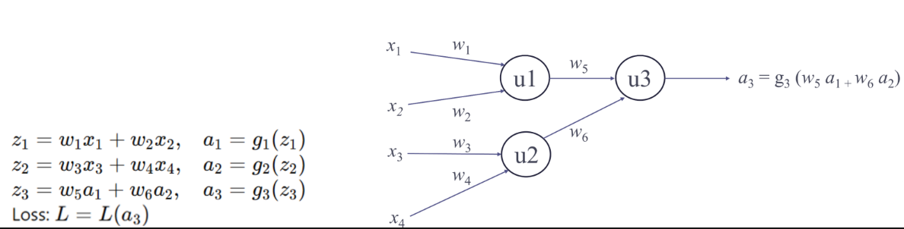

# Deep Learning

**Deep Learning (DL)** is a subfield of **Artificial Intelligence (AI)** that focuses on teaching computers to learn patterns from data using structures called **neural networks**, inspired by the human brain.

In simple terms:

> Deep Learning allows computers to learn from examples instead of being explicitly programmed.

Example:

* Instead of writing rules to recognize a cat 🐱,
* You show the computer **thousands of cat images**, and it **learns what makes a cat a cat**.

---

## Table of Contents
- [Deep Learning](#deep-learning)
  - [Table of Contents](#table-of-contents)
  - [**Artificial Neural Networks**](#artificial-neural-networks)
    - [How it all started (McCulloch \& Pitts – 1943)](#how-it-all-started-mcculloch--pitts--1943)
    - [**Linear Threshold Unit (LTU) / Artificial Neuron**](#linear-threshold-unit-ltu--artificial-neuron)
  - [**LTU as Logic Gates**](#ltu-as-logic-gates)
    - [**OR Gate using LTU**](#or-gate-using-ltu)
    - [**AND Gate using LTU**](#and-gate-using-ltu)
  - [**Why LTUs were important**](#why-ltus-were-important)
  - [**Birth of Learning: The Perceptron (1957)**](#birth-of-learning-the-perceptron-1957)
    - [**Output**](#output)
  - [**What does the Perceptron learning rule do?**](#what-does-the-perceptron-learning-rule-do)
  - [**Perceptron as a Linear Classifier**](#perceptron-as-a-linear-classifier)
  - [**Feed-Forward Network of Perceptrons**](#feed-forward-network-of-perceptrons)
  - [**Multi-Layer Perceptron (MLP)**](#multi-layer-perceptron-mlp)
  - [**Why Hidden Layers Matter**](#why-hidden-layers-matter)
  - [**Mathematical View of a Neural Network**](#mathematical-view-of-a-neural-network)
  - [**Activation Functions**](#activation-functions)
  - [**Training a Neural Network**](#training-a-neural-network)
  - [**Loss**](#loss)
  - [**Gradient Descent**](#gradient-descent)
  - [**Backpropagation**](#backpropagation)
- [Goal:](#goal)
- [Intuition recap:](#intuition-recap)

---

## **Artificial Neural Networks**

### How it all started (McCulloch & Pitts – 1943)

In 1943, **McCulloch and Pitts** proposed a mathematical model inspired by **biological neurons**.
They showed that simple computational units could perform **logical operations** like AND and OR.

These units were called **Linear Threshold Units (LTUs)**.

This idea laid the **foundation of artificial neural networks**.

---

### **Linear Threshold Unit (LTU) / Artificial Neuron**

**Basic components of an LTU**

An LTU consists of:

* **Inputs**: (x1, x2)
* **Weights**: (w1, w2)
* **Bias**: (b)
* **Weighted sum**
* **Activation function**

**Mathematical model**

$$
z = \sum_i w_i x_i + b
$$

The output is:
$$
y =
\begin{cases}
1 & \text{if } z \ge \text{threshold} \
0 & \text{otherwise}
\end{cases}
$$

This activation function is a **step function**.

---

## **LTU as Logic Gates**

### **OR Gate using LTU**

Choose:

* (w_1 = 1), (w_2 = 1)
* (b = -0.5)

Then:
$$
z = x_1 + x_2 - 0.5
$$

This produces output **1 whenever at least one input is 1**, exactly like an OR gate.

---

### **AND Gate using LTU**

Choose:

* (w_1 = 1), (w_2 = 1)
* (b = -1.5)

Then:
$$
z = x_1 + x_2 - 1.5
$$

This produces output **1 only when both inputs are 1**, exactly like an AND gate.

---

## **Why LTUs were important**

* They behaved like **biological neurons**
* A network of LTUs could compute **Boolean functions**
* They were the **first artificial neurons**

**Major limitation**

* **Weights were manually chosen**
* **No learning mechanism**

---

## **Birth of Learning: The Perceptron (1957)**

In 1957, **Frank Rosenblatt** introduced the **Perceptron**.

**Key improvement**

* Introduced a **learning rule**
* Weights could be **automatically adjusted**

So now, the model could **learn from data**.

**Perceptron Model**

A perceptron is an **LTU with learning**.

### **Output**

$$
o = \text{step}\left(\sum_i w_i x_i + b\right)
$$

**Learning Rule**

$$
w_i \leftarrow w_i + \eta (t - o) x_i
$$

Where:

* $t$ = target (correct output)
* $o$ = computed output
* $\eta$ = learning rate

---

## **What does the Perceptron learning rule do?**

* If prediction is **wrong**, weights are updated
* If prediction is **correct**, little or no change happens
* The update is proportional to:

    * the **error** $(t - o)$
    * the **input value** $x_i$

👉 This is **training**

---

## **Perceptron as a Linear Classifier**

A perceptron separates data using a **straight line (or hyperplane)**.

That is why it is called a **linear binary classifier**.

Linear separable data is the Data that can be separated by **one straight line**.

**Limitations of the Perceptron**

* Can only learn **linearly separable data**
* Cannot solve problems like **XOR**
* Has **only one layer of weights**

This limitation caused a temporary **decline in neural network research**.

---

## **Feed-Forward Network of Perceptrons**

To overcome these limits, researchers connected **multiple perceptrons together**.

**Feed-forward**

* Information flows **only forward**
* No loops or feedback

This led to **Multi-Layer Perceptrons (MLPs)**.

---

## **Multi-Layer Perceptron (MLP)**

An MLP is a neural network with:

* **Input layer**
* **One or more hidden layers**
* **Output layer**

Each layer contains perceptrons (units).

**Fully Connected Network**

A Fully Connected Network (also called a dense network) is a type of Multi-Layer Perceptron (MLP).

* Every unit in one layer connects to **all units in the next layer**
* No connections within the same layer

---

## **Why Hidden Layers Matter**

Hidden layers allow:

* Learning **non-linear relationships**
* Solving complex problems like XOR
* Approximating any function (with enough neurons)

This made neural networks **powerful**.

**Why is it Called “Deep”?**

The word **“deep”** refers to the **number of layers** in a neural network.

* Shallow model → 1–2 layers
* Deep model → many layers (sometimes hundreds)

More layers = ability to learn **more complex patterns**

---

## **Mathematical View of a Neural Network**

Let:

* ($a_i$) = output of unit (i)
* ($w_{i,j}$) = weight from unit (i) to unit (j)

**Output of unit (j)**

$$
a_j = g_j\left(\sum_i w_{i,j} a_i\right)
$$

Where:

* ($g_j$) is a **non-linear activation function**

---

## **Activation Functions**

An **activation function** is a mathematical function applied to the output of a neuron (after calculating the weighted sum of inputs). Its main purpose is to **introduce non-linearity** into the network so that it can learn complex patterns.

1. Non-linearity allows neural networks to learn **complex patterns** beyond straight lines.
2. Without it, multiple layers collapse into a single linear function, no matter how deep.
3. Real-world data (images, speech, text) is mostly **non-linear**, so linear models fail.
4. Non-linear activation functions (ReLU, Sigmoid, Tanh) enable networks to **model curves and interactions**.
5. It makes neural networks **powerful enough to solve problems like XOR and image recognition**.

**Common Activation Functions** :

1. **Step Function** – outputs 0 or 1 based on a threshold.
2. **Sigmoid Function** – outputs values between 0 and 1; useful for probabilities.
3. **Tanh Function** – outputs values between -1 and 1; zero-centered.
4. **ReLU (Rectified Linear Unit)** – outputs 0 for negative inputs and the input itself if positive; widely used in hidden layers.
5. **Leaky ReLU** – like ReLU but allows a small negative value for negative inputs.
6. **Softmax Function** – converts outputs into probabilities that sum to 1, used for multi-class classification.

**Purpose:** Without an activation function, the neural network would behave like a linear model, no matter how many layers it has.

**Why not step function?**

* Not differentiable
* Cannot be used with gradient descent

**Why not linear function?**

* Multiple layers collapse into one
* Cannot learn non-linear patterns
  
---

## **Training a Neural Network**

**Goal**

Find weights ($w_i$) that **minimize loss (L)**.

**Steps**

1. Initialize weights
2. Forward pass → compute output
3. Compute loss
4. Compute gradients
5. Update weights

---

## **Loss**

Loss in a neural network is a numerical measure of how incorrect the model’s prediction is compared to the actual target value. It is calculated after the network produces an output during the forward pass. The main goal of training a neural network is to minimize this loss.

Different loss functions are used for different types of problems. For regression tasks, Mean Squared Error measures the average squared difference between predicted and true values. For binary classification, Binary Cross-Entropy measures how well the predicted probabilities match the correct labels. For multi-class classification, Categorical Cross-Entropy evaluates how close the predicted class probabilities are to the true class.

The computed loss is then used in backpropagation to calculate gradients, and gradient descent updates the weights and biases to reduce the loss over time.

Cross-entropy is a common loss function for multi-class classifications. But we can skip the details and just focus on a generic loss function `L`

---

## **Gradient Descent**

Gradient Descent is an **optimization algorithm** used to train neural networks by **minimizing the loss function**. Its goal is to find the best values of weights and biases that reduce the error between the predicted output and the target output.

During training, the network first performs a **forward pass** to compute the output and the loss. Then, using **backpropagation**, it calculates the **gradient of the loss** with respect to each weight and bias. These gradients show the **direction of steepest increase** of the loss.

To reduce the loss, the parameters are updated in the **opposite direction of the gradient**:

$$
w \leftarrow w - \eta \frac{\partial L}{\partial w}, \quad
b \leftarrow b - \eta \frac{\partial L}{\partial b}
$$

Here, $\eta$ is the **learning rate**, which controls how big each update step is. Repeating this process over many iterations gradually moves the network toward a **minimum loss**, resulting in better predictions.

In short, **gradient descent is how neural networks learn** by continuously adjusting their parameters to improve performance.

---

## **Backpropagation**

**Backpropagation** (short for **backward propagation of errors**) is an algorithm used to **train neural networks**. Its main goal is to **compute the gradient of the loss function with respect to each weight and bias** in the network.

* It allows the network to **know how to adjust weights and biases** to reduce the error.
* Works **layer by layer from output back to input** using the **chain rule**.

---

we will understand it using an example 

**Setup — Your network equations**:

$$
\begin{cases}
z_1 = w_1 x_1 + w_2 x_2 \\
a_1 = g_1(z_1) \\
z_2 = w_3 x_3 + w_4 x_4 \\
a_2 = g_2(z_2) \\
z_3 = w_5 a_1 + w_6 a_2 \\
a_3 = g_3(z_3) \\
L = L(a_3) \quad \text{(loss function depending on output)}
\end{cases}
$$

---

# Goal:

We want to compute the gradient of loss (L) w.r.t. **each weight**, i.e., ($\frac{\partial L}{\partial w_i}$) for ($i=1, \ldots, 6$), to update the weights to minimize the loss.

---

**Step 1: Forward pass — compute all intermediate values**

Before backpropagation, compute ($z_1$, $a_1$, $z_2$, $a_2$, $z_3$, $a_3$) using current weights, inputs, and activation functions.

This is just applying the formulas above to get numeric values (not part of gradient calculation but necessary to know values at each neuron).

**Step 2: Calculate output layer error term ($\delta_3$)**

What is ($\delta_3$)?

$$
\delta_3 = \frac{\partial L}{\partial z_3}
$$

This tells us how sensitive the loss is to changes in (z_3), the weighted sum before the activation at the output neuron.

Use chain rule to expand ($\delta_3$):

Since ($a_3 = g_3(z_3)$) and ($L$) depends on ($a_3$),

$$
\delta_3 = \frac{\partial L}{\partial z_3} = \frac{\partial L}{\partial a_3} \times \frac{\partial a_3}{\partial z_3} = \frac{\partial L}{\partial a_3} \times g_3'(z_3)
$$

* ($\frac{\partial L}{\partial a_3}$): How much the loss changes if output ($a_3$) changes (depends on your loss function, e.g., Mean Squared Error or Cross-Entropy).
* ($g_3'(z_3)$): Derivative of activation function at ($z_3$).

---

**Step 3: Compute gradients for output layer weights ($w_5$, $w_6$)**

Recall:

$$
z_3 = w_5 a_1 + w_6 a_2
$$

Use chain rule to compute gradients of loss w.r.t weights:

$$
\frac{\partial L}{\partial w_5} = \frac{\partial L}{\partial z_3} \times \frac{\partial z_3}{\partial w_5} = \delta_3 \times a_1
$$

$$
\frac{\partial L}{\partial w_6} = \delta_3 \times a_2
$$

**Step 4: Calculate hidden layer error terms ($\delta_1$, $\delta_2$)**

Now, find how the loss changes with respect to the weighted sums at hidden neurons:

$$
\delta_1 = \frac{\partial L}{\partial z_1}, \quad \delta_2 = \frac{\partial L}{\partial z_2}
$$

**Use chain rule again — consider dependencies**:

* ($L$) depends on ($a_3$), which depends on ($a_1$) (through ($z_3$))
* ($a_1 = g_1(z_1)$), so changes in ($z_1$) affect ($a_1$), which affect ($L$)

Write explicitly:

$$
\delta_1 = \frac{\partial L}{\partial z_1} = \frac{\partial L}{\partial a_1} \times \frac{\partial a_1}{\partial z_1} = \frac{\partial L}{\partial a_1} \times g_1'(z_1)
$$

But ($\frac{\partial L}{\partial a_1}$) comes from the next layer:

$$
\frac{\partial L}{\partial a_1} = \frac{\partial L}{\partial z_3} \times \frac{\partial z_3}{\partial a_1} = \delta_3 \times w_5
$$

So,

$$
\boxed{
\delta_1 = \delta_3 \times w_5 \times g_1'(z_1)
}
$$

Similarly for neuron ($u_2$):

$$
\delta_2 = \delta_3 \times w_6 \times g_2'(z_2)
$$

---

**Step 5: Compute gradients for hidden layer weights ($w_1$, $w_2$, $w_3$, $w_4$)**

Using the definition of ($z_1$, $z_2$):

$$
z_1 = w_1 x_1 + w_2 x_2
$$

$$
z_2 = w_3 x_3 + w_4 x_4
$$

Calculate gradients:

$$
\frac{\partial L}{\partial w_1} = \frac{\partial L}{\partial z_1} \times \frac{\partial z_1}{\partial w_1} = \delta_1 \times x_1
$$

$$
\frac{\partial L}{\partial w_2} = \delta_1 \times x_2
$$

$$
\frac{\partial L}{\partial w_3} = \delta_2 \times x_3
$$

$$
\frac{\partial L}{\partial w_4} = \delta_2 \times x_4
$$

**Step 6: Update weights and biases with learning rate ($\eta$)**

Once all gradients are computed:

$$
w_i \leftarrow w_i - \eta \frac{\partial L}{\partial w_i}
$$

$$
b_j \leftarrow b_j - \eta \frac{\partial L}{\partial b_j}
$$

---

**Summary table of gradients**:

| Parameter | Gradient              |
| --------- | --------------------- |
| ($w_5$)     | ($\delta_3 \times a_1$) |
| ($w_6$)     | ($\delta_3 \times a_2$) |
| ($w_1$)     | ($\delta_1 \times x_1$) |
| ($w_2$)     | ($\delta_1 \times x_2$) |
| ($w_3$)     | ($\delta_2 \times x_3$) |
| ($w_4$)     | ($\delta_2 \times x_4$) |
| ($b_3$)     | ($\delta_3$)            |
| ($b_1$)     | ($\delta_1$)            |
| ($b_2$)     | ($\delta_2$)            |

---

