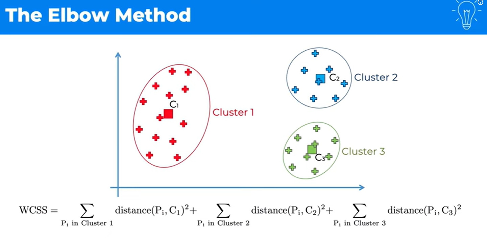

# K-Means

**K-Means** is an **unsupervised machine learning algorithm** used to divide a dataset into **K distinct clusters** based on similarity.

Each cluster is represented by a **centroid**, which is the mean of all points in that cluster.

---

## Table of Contents
- [K-Means](#k-means)
  - [Table of Contents](#table-of-contents)
  - [Objective of K-Means](#objective-of-k-means)
  - [Working of K-Means](#working-of-k-means)
  - [Pseudocode](#pseudocode)
  - [Distance Measure](#distance-measure)
  - [Choosing the Value of K](#choosing-the-value-of-k)
  - [Advantages](#advantages)
  - [Disadvantages](#disadvantages)
  - [Applications](#applications)
  


## Objective of K-Means

The main goal of K-Means is to **minimize the total distance between data points and their cluster centroids**.

Mathematically, it minimizes the **Within-Cluster Sum of Squares (WCSS)**:

$$
\min \sum_{i=1}^{K} \sum_{x \in C_i} |x - \mu_i|^2
$$


**Where:**

* $K$ = number of clusters
* $C_i$ = $i$-th cluster
* $\mu_i$ = centroid of cluster $C_i$
* $\lvert x - \mu_i \rvert^2$ = squared Euclidean distance


---

## Working of K-Means

**Choose K**

Select the number of clusters (K).


**Initialize Centroids**

Randomly select **K data points** as initial centroids
(or use **K-Means++** for better initialization).


**Assignment Step**

For each data point:

* Calculate the distance to each centroid
* Assign the point to the **nearest centroid**

$$
\text{Assign } x \rightarrow \arg\min |x - \mu_i|
$$

---

**Update Step**

Recalculate each centroid as the **mean of all points assigned to that cluster**:

$$
\mu_i = \frac{1}{|C_i|} \sum_{x \in C_i} x
$$

---

**Repeat**

Repeat **Assignment** and **Update** steps until:

* Centroids do not change
* Or cluster assignments remain the same
* Or maximum iterations are reached

---

## Pseudocode

```
Algorithm: K-Means Clustering

Input: 
    Dataset D
    Number of clusters K

Output:
    K clusters with their centroids

Procedure:
1. Initialize K centroids randomly from the dataset

2. Repeat:
       a. For each data point in D:
              Assign the point to the nearest centroid
       b. For each cluster:
              Update the centroid by computing the mean of assigned points

3. Until centroids do not change (convergence)

```

---

## Distance Measure

Most commonly used:

* **Euclidean Distance**

$$
d(x,y) = \sqrt{\sum (x_i - y_i)^2}
$$

---

## Choosing the Value of K

there are many ways to select k but here we will only discuss Elbow Method

**Elbow Method**

one thing to know is that to calculate the wcss we need the clusters to already exist so it is reverse we cannot first use elbow method directly we needd to first run K-mean 




> know that the more the clusters there are the more the value of wcss decreses


* Plot **WCSS vs K**
* Choose K where the curve forms an elbow


## Advantages

* Simple and easy to implement
* Fast and efficient
* Works well with large datasets

---

## Disadvantages

* Must choose K beforehand
* Sensitive to initial centroids
* Sensitive to outliers
* Poor performance for non-spherical clusters

---

## Applications

* Customer segmentation
* Image compression
* Pattern recognition
* Document clustering
* Market analysis

---

