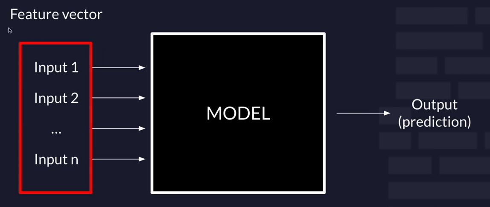

# Machine learning

Machine learning is a subdomain of computer science that focuses on algorithms which help a computer learn from data without explicit programming

**Explicit** programming means writing hard-coded, rule-based instructions that tell the computer exactly what to do in every situation.





## Table of Contents
- [Machine learning](#machine-learning)
  - [Table of Contents](#table-of-contents)
  - [Features](#features)
    - [**1. Qualitative Data**](#1-qualitative-data)
    - [**2. Quantitative Data**](#2-quantitative-data)
  - [Types of Machine Learning](#types-of-machine-learning)
    - [Supervised learning](#supervised-learning)
    - [UnSupervised learning](#unsupervised-learning)
  - [Machine learning workflow](#machine-learning-workflow)
    - [Data Collection](#data-collection)
    - [Data Preprocessing](#data-preprocessing)
    - [Data Split](#data-split)
    - [Training](#training)
    - [Testing \& Evaluation](#testing--evaluation)
  - [Descriptive Statistics](#descriptive-statistics)
    - [Central Tendency (Typical Value)](#central-tendency-typical-value)
    - [Variability (Spread of Data)](#variability-spread-of-data)
    - [Correlation (Relationship Between Variables)](#correlation-relationship-between-variables)
    - [Outliers (Unusual Data Points)](#outliers-unusual-data-points)


## Features

**Features** are the individual measurable attributes or properties of data that are used as input to a machine learning model.

**In simple words:**
Features are the information (variables) that help a model learn and make decisions.

Features can be divided into the following types:


### **1. Qualitative Data**

Qualitative data refers to **non-numerical information** that can be sorted into categories or groups.

**Example:**
Gender (girl or boy)

Even if numbers like `0` and `1` are used, they are **only labels**, not real numerical values.

**Types of Qualitative Data**

- **Nominal Data (No Inherent Order)**

  Nominal data is a type of categorical data where values represent **names or labels** with **no inherent order or ranking**.
  
  **Example:**
  Countries, colors
  
  To feed nominal data into a computer, we use **One-Hot Encoding**.

**One-Hot Encoding** is a technique used in machine learning to convert categorical (nominal) data into numerical form so that it can be used by ML algorithms.

It does **not** work like this ❌:

```
Red = 1, Blue = 2, Green = 3
```

Instead, we use ✅:

```bash
Red   Blue  Green
1     0     0
0     1     0
0     0     1
```


- **Ordinal Data (Inherent Order)**

  Ordinal data is categorical data with an **inherent order or ranking** among categories, but **without equal or measurable differences** between them.
  
  **Example:**
  Satisfaction level: `Low → Medium → High`


### **2. Quantitative Data**

Quantitative data refers to **numerical data** that represents measurable quantities.

It answers questions like:

* “How much?”
* “How many?”
* “How often?”

**Types of Quantitative Data**

* **Discrete data:** Countable values
  **Example:** Shoe sizes

* **Continuous data:** Measurable values
  **Example:** A person’s height, room temperature


---

<br>
<br>
<br>

## Types of Machine Learning

1. Supervised learning - uses labeled inputs (meaning the input has a corresponding output label) to train models and learn outputs
2. Unsupervised learning - uses unlabeled data to learn about patterns in data
3. Reinforcement learning - agent learning in interactive environment based on rewards and penalties


### Supervised learning

**Supervised learning** is a type of machine learning where a model is trained using **labeled data**—that is, data where the **correct output is already known**.

In supervised learning:

* Each training example consists of **input features** and a **known output (label)**.
* The algorithm learns a **mapping** from inputs to outputs.
* After training, the model can **predict outputs for new, unseen data**.

**Example**

Suppose you want to predict whether an email is spam.

| Email Text        | Label    |
| ----------------- | -------- |
| “Win a prize”     | Spam     |
| “Meeting at 3 PM” | Not Spam |

The model learns patterns that distinguish spam from non-spam emails.

click [here](./Supervised%20learning.md) to learn more


### UnSupervised learning

**Unsupervised learning** is a type of machine learning where the model is trained on **unlabeled data**, meaning **no correct output is provided**. 

In unsupervised learning:

* The data contains **only input features**
* The algorithm tries to **discover hidden patterns, structures, or relationships**
* There are **no predefined labels or answers**

**Example**

Suppose you have customer data with:

* Age
* Income
* Shopping behavior

But **no information** about customer types.

The algorithm automatically groups similar customers together.

click [here](./UnSupervised%20learning.md) to learn more


---

<br>
<br>


---

## Machine learning workflow


### Data Collection

Data collection is the process of gathering raw data that will be used to train and test a machine learning model.

**Sources of Data**

* Databases (SQL, NoSQL)
* CSV / Excel files
* Sensors and IoT devices
* Network traffic logs
* Web scraping
* APIs
* Public datasets (e.g., CIC-IDS2017, UCI, Kaggle)

**Importance**

* The **quality of data directly affects model performance**
* More relevant and diverse data improves generalization
* Poor data leads to biased or inaccurate models

**Example**

* Collecting network traffic records for intrusion detection
* Collecting student marks for performance prediction

---

### Data Preprocessing

Data preprocessing converts raw data into a clean and usable format for machine learning algorithms.

**Common Preprocessing Steps**

- Data Cleaning

  * Handling missing values (remove or fill with mean/median/mode)
  * Removing duplicate records
  * Fixing inconsistent values

- Feature Selection

  * Selecting relevant features
  * Removing irrelevant or redundant attributes
  * Reduces noise and improves performance

- Feature Encoding

  * Converting categorical data into numerical form
  * Techniques:
  
    * One-Hot Encoding (nominal data)
    * Label Encoding (ordinal data)

- Feature Scaling

  * Ensuring features are on the same scale
  * Techniques:
  
    * Min-Max Scaling
    * Standardization (Z-score)

- Handling Imbalanced Data

  * Oversampling (SMOTE)
  * Undersampling
  * Class weighting

**Importance**

* Improves model accuracy
* Reduces training time
* Prevents bias due to uneven feature scales

---

### Data Split

The dataset is divided into separate parts to evaluate model performance fairly.

**Common Splits**

* **Training set:** 70–80%
* **Testing set:** 20–30%

Sometimes a third set is used:

* **Validation set:** Used for hyperparameter tuning

**Purpose**

* Prevents overfitting
* Ensures the model performs well on unseen data

**Example**

* 80% data used for training
* 20% data used for testing

---

### Training

Training is the process where the machine learning algorithm learns patterns from the training data.

**What Happens During Training**

* The algorithm analyzes feature–label relationships
* Adjusts internal parameters to minimize error
* Uses optimization techniques (e.g., gradient descent)


**Output**

* A trained model
* Learned weights and parameters

---

### Testing & Evaluation

After training, the model is evaluated using the testing dataset.

**Purpose**

* Measure how well the model performs on unseen data
* Check generalization capability

**Evaluation Metrics**

- For Classification

  * Accuracy
  * Precision
  * Recall
  * F1-score
  * Confusion Matrix

- For Regression

  * Mean Squared Error (MSE)
  * Mean Absolute Error (MAE)
  * R² Score

**Example**

* A network intrusion detection model achieving 99% accuracy on test data


---

<br>
<br>


## Descriptive Statistics

Descriptive statistics is used to **summarize and understand data** before applying machine learning models.

It helps us:

* Understand the data
* Find patterns
* Detect problems in data
* Make better decisions before training a model


### Central Tendency (Typical Value)

Central tendency tells us the **typical or central value** of the data.

- a) Mean (Average)

  * Add all values and divide by total number of values
  * **Sensitive to extreme values (outliers)**

  Example:
  Data = `[2, 4, 4, 6, 8]`
  Mean = 4.8
  
  If one value is very large or very small, the mean changes a lot.

---

- b) Median (Middle Value)

  * Arrange data in order and pick the middle value
  * **Not affected much by outliers**
  * Useful when data has extreme values
  
  Example:
  Sorted data = `[2, 4, 4, 6, 8]`
  Median = 4

---

- c) Mode (Most Common Value)

  * Value that appears most frequently
  * Best for **categorical or discrete data**
  
  Example:
  Mode = 4

---

### Variability (Spread of Data)

Variability tells us **how spread out the data is**.

-  a) Range

  * Difference between the largest and smallest values
  * Shows how wide the data is
  
  Example:
  Range = 8 − 2 = 6

---

- b) Variance

  * Measures how far values are from the mean (on average)
  * Uses squared differences
  
  High variance = values are very spread out
  Low variance = values are close to the mean

---

- c) Standard Deviation (SD)

  * Square root of variance
  * Easier to understand than variance
  * Shows how much values differ from the average
  
  Example:
  
  * If students’ marks vary a lot → SD is high
  * If students’ marks are similar → SD is low

---

### Correlation (Relationship Between Variables)

Correlation tells us **how two variables are related**.

**Correlation values range from**:

* **+1** → strong positive relationship
* **–1** → strong negative relationship
* **0** → no relationship

**Examples**:

* Height & weight → positive correlation
* Study hours & exam marks → positive correlation
* Social media time & CGPA → negative correlation

---

### Outliers (Unusual Data Points)

Outliers are values that are **very different from the rest of the data**.

**Why outliers are a problem**:

* They can change the mean
* They can confuse machine learning models
* They can give wrong results

**Example**:

* Most students score 60–80
* One student scores 5 → outlier

**How to Detect Outliers**

* **Boxplot**
* **Z-score** (values > +3 or < –3)
* **IQR method**

---


