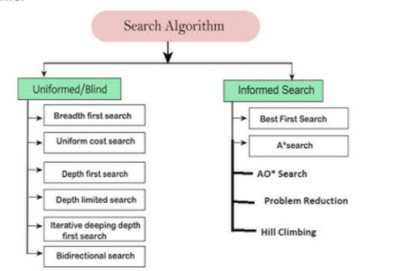
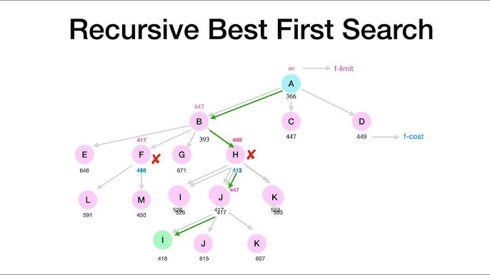
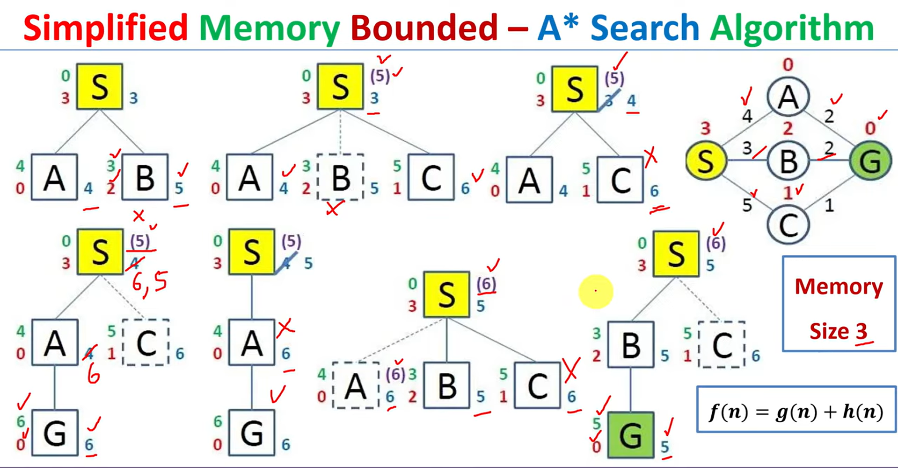
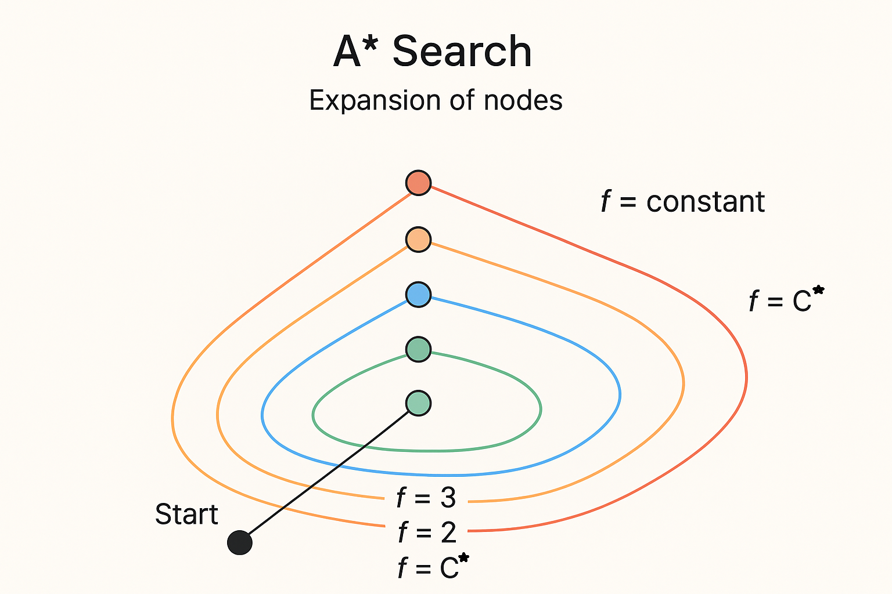

# Solving problems by searching

When an agent needs to achieve a goal it doesn’t know how to reach directly, it **looks ahead** by *searching* through a space of possible states and actions to find a sequence (a plan) that reaches the goal. This is the central idea of classical AI problem solving.

When the correct action to take is not immediately obvious, an agent may need to plan ahead
- To consider a sequence of actions that form a path to a goal state
- Such an agent is called a **problem-solving agent**
- The computational process it undertakes is called **search**

---

## **Table of Contents**

- [Solving problems by searching](#solving-problems-by-searching)
  - [**Table of Contents**](#table-of-contents)
  - [**Steps in Problem Solving by Searching**](#steps-in-problem-solving-by-searching)
    - [**1. Goal Formulation — Define What You Want to Achieve**](#1-goal-formulation--define-what-you-want-to-achieve)
    - [**2. Problem Formulation — Define How to Reach the Goal**](#2-problem-formulation--define-how-to-reach-the-goal)
    - [**3. Search — Explore Possible Action Sequences**](#3-search--explore-possible-action-sequences)
    - [**4. Execution — Carry Out the Plan**](#4-execution--carry-out-the-plan)
- [**Search Tree**](#search-tree)
  - [**Node Generation and Expansion**](#node-generation-and-expansion)
    - [**Terminology**](#terminology)
  - [**Search Data Structures**](#search-data-structures)
  - [**Frontier Management**](#frontier-management)
  - [**Types of Frontier Data Structures**](#types-of-frontier-data-structures)
  - [**Evaluating Search Strategies**](#evaluating-search-strategies)
    - [**Measured In Terms Of:**](#measured-in-terms-of)
- [**Search algorithms**](#search-algorithms)
  - [**Uninformed (Blind) Search**](#uninformed-blind-search)
  - [**Types**](#types)
    - [**1. Breadth-First Search (BFS)**](#1-breadth-first-search-bfs)
    - [**2. Depth-First Search (DFS)**](#2-depth-first-search-dfs)
    - [**3. Depth-Limited Search (DLS)**](#3-depth-limited-search-dls)
    - [**4. Iterative Deepening Search (IDS)**](#4-iterative-deepening-search-ids)
    - [**5. Bidirectional Search with Iterative Deepening**](#5-bidirectional-search-with-iterative-deepening)
    - [**6. Uniform Cost Search (UCS) Dijkstra’s algorithm**](#6-uniform-cost-search-ucs-dijkstras-algorithm)
  - [**Informed (heuristic) search:**](#informed-heuristic-search)
  - [**Heuristic Function (h(n))**](#heuristic-function-hn)
    - [**Heuristic Function and Its Properties**](#heuristic-function-and-its-properties)
    - [**1. Admissibility**](#1-admissibility)
    - [**2. Consistency (or Monotonicity)**](#2-consistency-or-monotonicity)
  - [**Types**](#types-1)
    - [1. **Best-First Search**](#1-best-first-search)
    - [2. **Greedy Best-First Search**](#2-greedy-best-first-search)
    - [3. A\* Search (A-Star Search)](#3-a-search-a-star-search)
      - [**Satisficing Search \& Weighted A**\*](#satisficing-search--weighted-a)
    - [**Why memory-bounded search?**](#why-memory-bounded-search)
      - [1) **Iterative Deepening A**\* (IDA\*)](#1-iterative-deepening-a-ida)
      - [2) **Recursive Best-First Search (RBFS)**](#2-recursive-best-first-search-rbfs)
      - [3) **Simplified Memory-Bounded A* (SMA*)\*\*](#3-simplified-memory-bounded-a-sma)
  - [**comparison table**](#comparison-table)
  - [**What “Contours” Really Are**](#what-contours-really-are)

---

## **Steps in Problem Solving by Searching**

This process involves **four key steps**:

### **1. Goal Formulation — Define What You Want to Achieve**

This is where the agent determines **what the desired outcome is**.

* The **goal** defines the target or condition the agent wants to reach.
* It guides the agent’s decisions and filters which actions or states are relevant.

**Example:**
A navigation robot’s goal might be: *“Reach the destination point (x, y).”*
A chess-playing agent’s goal might be: *“Achieve a checkmate.”*

**Purpose:**
Without a clear goal, the agent has no direction — it cannot decide which states are “good” or “bad.”

---

### **2. Problem Formulation — Define How to Reach the Goal**

Once the goal is known, the agent must define the **problem space** or an  — i.e., the structure of the world it will search through.

This includes:

* **Initial state:** Where the agent starts.
* **Goal states:** states which satisfy the goal
* **State space**: the set of all states reachable from Initial state via actions.
* **Actions:** The possible moves the agent can take.
* **Transition model:** What state results from each action.
* **Goal test:** A way to check if the agent has reached the goal.
* **Path cost (Action cost function:):** A function that assigns a cost to each sequence of actions (used to find the *best* path).

**Example:**
In a route-finding problem:

* Initial state = Current location
* Actions = Move north, south, east, west
* Transition model = New location after each move
* Goal test = Is location = destination?
* Path cost = Distance or time

**Purpose:**
This step translates a real-world problem into a **searchable model** the agent can reason about.

---

### **3. Search — Explore Possible Action Sequences**

Now the agent uses a **search algorithm** to find a sequence of actions that leads from the **initial state** to a **goal state**.

* The search process can be visualized as exploring a **search tree**, where:

  * Nodes = possible states
  * Edges = actions that move between states
* The agent “looks ahead” by simulating the results of actions *before actually performing them.*

**Common search strategies:**

* **Uninformed (blind) search:**
  No knowledge of the goal location (e.g., Breadth-First Search, Depth-First Search).
* **Informed (heuristic) search:**
  Uses domain knowledge to guide the search (e.g., A*, Greedy Best-First Search).

**Purpose:**
This is where the agent **plans** — trying out hypothetical action sequences until it finds one that achieves the goal efficiently.

---

### **4. Execution — Carry Out the Plan**

Once the agent finds a valid solution (a sequence of actions), it **executes** those actions in the real world.

* The agent follows the chosen path **step-by-step**.
* It may re-check the environment between steps to ensure conditions haven’t changed.
* If the environment is dynamic, the agent may need to **replan**.

**Example:**
After computing the shortest path on a map, a delivery robot executes each move command until it reaches the destination.

**Purpose:**
This step turns the **planned solution** into **real-world behavior** that achieves the goal.

---

 
 

# **Search Tree**

* The **state space** represents all possible configurations (states) in the problem domain, along with the **actions** that transition one state to another.
* A **search tree** is built on top of this state space — it visualizes the **paths between states** as the agent searches for a route to the goal.
* Each **node** in the tree represents a state, and **edges** represent actions that move the agent from one state to another.
* The **root node** represents the initial state, and the **goal node** represents the state that satisfies the goal condition.

> The search tree “superimposes” a structure over the abstract state space to help visualize and manage the search process.

 

 

---

## **Node Generation and Expansion**

* At each node (representing a state), the agent may have **multiple choices of actions**.
* For each possible action, a **new (successor) node** is generated.
* When all successor nodes of a node have been generated, that node is said to be **expanded**.
* All nodes that are **generated or expanded** are said to have been **reached**.

### **Terminology**

| **Term**     | **Meaning**                                                                  |
| ------------ | ---------------------------------------------------------------------------- |
| **Interior** | Nodes that have been expanded (i.e., explored completely).                   |
| **Frontier** | Nodes that have been generated but not yet expanded.                         |
| **Exterior** | Nodes that have not been generated yet (unreached part of the search space). |

> In short:
> **Generated → Frontier → Expanded (Interior).**

 

 

here the `S0` is **Interior** and both the `S1` & `S2` are **Frontier** and rest are **Exterior** which are not generated yet.
  
---

## **Search Data Structures**

A search algorithm needs a **data structure** to keep track of the search tree as it’s being constructed.
For each node `n`, we maintain the following components:

| **Component** | **Description**                                         |
| ------------- | ------------------------------------------------------- |
| `n.STATE`     | The state the node represents.                          |
| `n.PARENT`    | The parent node that generated this node.               |
| `n.ACTION`    | The action applied to the parent to generate this node. |
| `n.PATH-COST` | The total cost from the initial state to this node.     |

This information allows the algorithm to **reconstruct the full path** from the start state to any node, including the goal.

---

## **Frontier Management**

The **frontier** (also known as the **open list**) contains all nodes that have been **generated but not yet expanded**.
It represents the **boundary** between explored and unexplored parts of the search tree.

Operations used for managing the frontier:

* `IS-EMPTY(frontier)` → True if the frontier has no nodes.
* `POP(frontier)` → Removes and returns the next node to expand.
* `TOP(frontier)` → Returns (but does not remove) the next node.
* `ADD(node, frontier)` → Inserts a node into the frontier according to the search strategy.

The **behavior of the frontier** (i.e., which node is expanded next) depends on the **type of data structure** used.

---

## **Types of Frontier Data Structures**

| **Data Structure**                   | **Node Selection Rule**                                                           | **Used In**                    |
| ------------------------------------ | --------------------------------------------------------------------------------- | ------------------------------ |
| **FIFO Queue** (First-In, First-Out) | Expands the **oldest generated** node first.                                      | **Breadth-First Search (BFS)** |
| **LIFO Stack** (Last-In, First-Out)  | Expands the **most recently generated** node first.                               | **Depth-First Search (DFS)**   |
| **Priority Queue**                   | Expands the node with the **lowest cost** or **best evaluation function `f(n)`**. | **Best-First Search**, **A***  |

> The **data structure chosen for the frontier** directly determines the **search order**, **time and space complexity**, and **optimality** of the algorithm.

## **Evaluating Search Strategies**

When comparing different search algorithms, we evaluate them along **four major dimensions**:

| **Criterion**         | **Question**                                             | **Explanation**                                |
| --------------------- | -------------------------------------------------------- | ---------------------------------------------- |
| **Completeness**      | Will the algorithm always find a solution if one exists? | BFS is complete; DFS may not be.               |
| **Time Complexity**   | How long will it take to find a solution?                | Usually measured by number of states expanded. |
| **Space Complexity**  | How much memory does it require?                         | Depends on how many nodes are stored at once.  |
| **Optimality (Cost)** | Does it find the least-cost path?                        | A* and Uniform Cost Search are optimal.        |

### **Measured In Terms Of:**

* **b** – branching factor of the search tree (average number of successors per node)
* **d** – depth (number of actions) of the least-cost solution
* **m** – maximum depth of the state space (maximum number of actions in any path)

---

 
 

# **Search algorithms**

Search algorithms are strategies used by **intelligent agents** to explore possible **states** or **paths** in a problem space to reach a **goal state**.
They form the core of **problem-solving in Artificial Intelligence (AI)** — where the agent looks ahead, simulates actions, and evaluates possible outcomes.

 

 
 
 

Search algorithms are divided into two main categories:

- Uninformed (Blind) Search
- Informed (Heuristic) Search

## **Uninformed (Blind) Search**

**Uninformed search**, also called **blind search**, refers to search strategies that have **no additional information** about the goal location or distance — **other than what is provided in the problem definition**.

The agent does not know **which direction is better**; it explores the search space **systematically** or **brute-force**, until it finds a solution.

In other words:

> The algorithm does not use any domain-specific knowledge (like heuristics). It only uses the information available in the problem itself — the states, actions, and goal test.

---

**Characteristics**

* Does **not use a heuristic function**.
* Explores **all possibilities** in a uniform or systematic way.
* Works purely based on:

  * The **initial state**
  * The **goal state**
  * The **successor function** (actions available from each state)
* Typically used when **no prior knowledge** of the environment is available.
* Can be **inefficient** for large search spaces.

---

**Components Used in Uninformed Search**

1. **Initial State:** Where the search begins.
2. **Goal Test:** A function that checks if a given state is the goal.
3. **Successor Function:** Generates all possible next states from the current one.
4. **Path Cost (optional):** Used to measure the total cost from start to goal.

---

## **Types**

### **1. Breadth-First Search (BFS)**

* Explores all nodes at one **depth level** before moving to the next.
* Uses a **queue (FIFO)** data structure.

**Properties:**

* **Completeness:** Yes (it will find the goal if one exists)
* **Optimality:** Yes, if all step costs are equal
* **Time Complexity:** O(b^d)
* **Space Complexity:** O(b^d)

> `O(b^d)` means the number of nodes generated or visited grows exponentially with both the branching factor and the depth of the goal.

**Advantages:**

* Always finds the **shortest path** (minimum number of steps).
* Simple and systematic.

**Disadvantages:**

* **Memory-intensive**, since it stores all nodes at the current level.

**Steps**

* At each level, expand all nodes before moving to the next depth.
* If a node is a goal state, return the path and stop.
* Add each child node to the **queue** (FIFO order).
* Assumes all actions have the same cost.

* Idea: The root node is explored first, then all the successors of the root node are expanded next, then their successors, and so on.

 

 

So the result will be:

`A → B → C → D → E → F → G`

---

### **2. Depth-First Search (DFS)**

* Explores as **deeply as possible** before backtracking.
* Uses a **stack (LIFO)** or recursion.

**Properties:**

* **Completeness:** No (may get stuck in infinite paths)
* **Optimality:** No
* **Time Complexity:** O(b^m)
* **Space Complexity:** O(bm)

**Advantages:**

* **Memory efficient**.
* Finds a solution without exploring the entire tree.

**Disadvantages:**

* May go infinitely deep.
* May find a **non-optimal** solution.

 

 

so the result will be:

`A → B → D → E → C → F → G`

---

### **3. Depth-Limited Search (DLS)**

* A modified DFS that stops when a **predefined depth limit (l)** is reached.
* Prevents infinite loops.

**Properties:**

* **Completeness:** Yes (if goal depth ≤ limit) otherwize No
* **Optimality:** No
* **Time Complexity:** O(b^l)
* **Space Complexity:** O(bl)

**Advantages:**

* Prevents infinite paths.
* Less memory usage.

**Disadvantages:**

* Must **know an appropriate limit** beforehand.
* May **miss the goal** if limit is too small.

 

 

> where d is the `limit` here

---

### **4. Iterative Deepening Search (IDS)**

* Combines the benefits of **BFS** and **DFS**.
* Repeatedly performs **Depth-Limited Search** with increasing depth limits.

**Properties:**

* **Completeness:** Yes for finite b
* **Optimality:** Yes (for uniform cost)
* **Time Complexity:** O(b^d)
* **Space Complexity:** O(bd)

**Advantages:**

* Uses less memory (like DFS).
* Guarantees finding the **shortest path** (like BFS).

**Disadvantages:**

* Repeats some nodes multiple times.

 

 

> IDS uses memory similar to DFS, not BFS.
> 
> Even though it restarts the search multiple times, each individual depth-limited search is depth-first, so it only keeps the current path and a few siblings in memory.

---

### **5. Bidirectional Search with Iterative Deepening**

Searches **forward from the start** and **backward from the goal**, meeting in the middle — and applies **iterative deepening** on both directions to limit memory use.

It expands nodes **layer by layer** in both directions.

---

**Properties:**

* **Completeness:** Yes (if branching factor is finite)   
* **Optimality:** Yes (if both searches use BFS/IDDFS with uniform step cost)
* **Time Complexity:** O(b^(d/2)) — MUCH better than O(b^d)        
* **Space Complexity:** O(b^(d/2)) — improved but more than IDDFS  

> *d = depth of the solution*

**Advantages**

* Major reduction in search time (meeting in the middle).
* Uses less memory than standard bidirectional BFS (due to iterative deepening).
* Good for large search spaces.

**Disadvantages**

* Hard to implement for problems where **goal state is not explicitly defined**.
* Requires **reverse successor function** (not always available).
* Synchronizing both searches can be tricky.

 

 

both `1` and `16` will intersect at node `9`

> note that there are many version of `Bidirectional Search` based on `BFS` & `DFS` but here we are only taking about `Bidirectional Search` based on `IDS`

---

### **6. Uniform Cost Search (UCS) Dijkstra’s algorithm**

* Expands the node with the **lowest path cost (g(n))**, not by depth.
* Works even when step costs differ.

**Properties:**

* **Completeness:** Yes (if cost > 0)
* **Optimality:** Yes
* **Time Complexity:** O(b^1+(C*/ε))
* **Space Complexity:** O(b^1+(C*/ε))

**Advantages:**

* Finds **least-cost paths**.
* Works with **non-uniform costs**.

**Disadvantages:**

* Can be slow when costs are similar or large.

lets say if we want to reach `G`

 

 

so by using `Uniform Cost Search (UCS)` we can find the shortest path which is:

`A → C → F → G` with an total cost of `7.4`

---

 
 
 
 

## **Informed (heuristic) search:**

**Informed search** (also called *heuristic search*) uses extra problem-specific knowledge — a **heuristic function** — to guide the search toward the goal more efficiently than blind search. The heuristic provides an estimate of how “good” or how “close” a state is to the goal, allowing the algorithm to focus expansion on promising nodes.

---

## **Heuristic Function (h(n))**

A **heuristic function** is an estimate of the **cost from the current node** `n` to the **goal**.
It provides *guidance* to informed search algorithms (like **A*** and **Greedy Best-First Search**) so they can find solutions faster than uninformed methods.

### **Heuristic Function and Its Properties**

A **heuristic function**, usually written as `h(n)`, estimates the cost (or distance) from a node `n` to the goal.
The **quality** of a heuristic depends on two key mathematical properties:

1. **Admissibility**
2. **Consistency (Monotonicity)**

### **1. Admissibility**

A heuristic is **admissible** if it **never overestimates** the true cost to reach the goal.
It always provides an **optimistic estimate** — meaning the heuristic value is less than or equal to the actual cost.
Example: In a route-finding problem, the **straight-line distance** between two cities is admissible because it’s always shorter than or equal to the actual road distance.

### **2. Consistency (or Monotonicity)**

A heuristic is **consistent** if, for every node `n` and its successor `n′`, **h(n) ≤ cost(n, a , n′) + h(n′)**.
The estimated cost from the current node to the goal `h(n)` should not be greater than the cost to move to a neighbor `c(n, a, n′)`plus the estimated cost from that neighbor to the goal `h(n′)`.
Every consistent heuristic is also **admissible**, but not all admissible heuristics are consistent.

> `c(n, a, n′)` = cost of moving from node `n` to its neighbor `n′` via action `a`.

> it is diffferent from `g()` which is the total cost accumulated so far.

consistency is also shown as : `consistency = triangle inequality for heuristics`

where In geometry, the triangle inequality says: `Length(AB) ≤ Length(AC) + Length(CB)`

That is — the direct path between two points (A → B) is never longer than going through an intermediate point (A → C → B).

**Summery:**

* **Admissibility** ensures the search algorithm (like A*) will find the **optimal path**.
* **Consistency** ensures **efficiency**, allowing algorithms like A* to avoid revisiting nodes.

---

> donot confuse your self with Heuristic Value & Path Cost both are an different thing

| Term                 | Symbol | Meaning                                                                                             | Type                      |
| -------------------- | ------ | --------------------------------------------------------------------------------------------------- | ------------------------- |
| **Path Cost**        | `g(n)` | The **actual cost** from the **start node** to the **current node** `n` (sum of step costs so far). | **Known / Actual**        |
| **Heuristic Value**  | `h(n)` | The **estimated cost** from the **current node** `n` to the **goal**.                               | **Estimated / Predicted** |
| **Total Evaluation** | `f(n)` | Combines both: `f(n) = g(n) + h(n)` (used in **A*** search).                                        | **Decision metric**       |

---

## **Types**

### 1. **Best-First Search**

Best-First Search is an **informed search strategy** that expands the node which appears to be the **most promising**, based on an **evaluation function** `f(n)`.

The algorithm always selects the node with the **lowest value of `f(n)`** from the frontier (open list).

**Evaluation Function:**

`f(n)` determines how desirable a node is.
Different choices of `f(n)` lead to different algorithms:

* **Greedy Best-First Search:** `f(n) = h(n)` (only heuristic)
* **A* Search:** `f(n) = g(n) + h(n)` (path cost + heuristic)

**Algorithm Steps:**

1. Place the start node in the **frontier**.
2. Select the node with the **lowest f(n)** value.
3. If it’s the **goal node**, stop.
4. Otherwise, **expand** it and add successors to the frontier.
5. Repeat until the goal is found or the frontier is empty.

**Properties:**

* **Complete:** Yes (if the search space is finite and no loops)
* **Optimal:** Depends on the evaluation function

  * Not guaranteed for `f(n) = h(n)`
  * Guaranteed for A* with admissible `h(n)`
* **Time Complexity:** Depends on heuristic accuracy
* **Space Complexity:** Can be large (stores all generated nodes)

**Advantages:**

* More efficient than uninformed searches.
* Can find solutions quickly with good heuristics.

**Disadvantages:**

* May get stuck in loops if not careful.
* Performance depends heavily on the heuristic.

 

 

we use: `f(n)=g(n)`

where:

`f(n)` = evaluation function (used to choose which node to expand next)
`g(n)` = total path cost from the start node to node n

it will chose the node with th `lowest f(n)` value

---

### 2. **Greedy Best-First Search**

* Greedy Best-First Search is a specific type of Best-First Search.
* Expands the node that **appears closest to the goal** based on the **heuristic value h(n)**.
* It **ignores path cost (g(n))** and relies only on the heuristic estimate.
* `f(n) = h(n)`

**Properties:**

* **Completeness:** No (can get stuck in loops)
* **Optimality:** No (does not guarantee shortest path)
* **Time Complexity:** Depends on the accuracy of `h(n)`
* **Space Complexity:** Can be high — stores all generated nodes

**Advantages:**

* Very **fast** if the heuristic is good.
* Can quickly find a **feasible (not necessarily optimal)** solution.

**Disadvantages:**

* May get **trapped in local minima**.
* **Not guaranteed to find the optimal path.**

> A local minimum is a point that looks better (cheaper or closer to goal) than all its neighbors — but it’s not actually the best path to reach the goal.

 

 

Each node (A, B, C, D, etc.) has an `h(n)` value — a heuristic that estimates the cost (or distance) from that node to the goal.
So, it chooses the next node purely by the smallest heuristic value (the one that looks nearest to the goal).

Path found (one possible): `C → O → I → Z`

> it will fisrt go to node `T` but it has no child nodes so it backtrack and moves to the next one but if the `T` node has infinite childs and sub childs so it will result in `inCompleteness`.

---

### 3. A* Search (A-Star Search)

* **A*** Search is an **informed search algorithm** that combines the strengths of **Uniform Cost Search (UCS)** and **Greedy Best-First Search**.
* It selects the next node based on the **lowest total estimated cost**:  
* f(n) = g(n) + h(n)

Where:

* `g(n)` = actual cost from the start node to the current node
* `h(n)` = estimated cost from the current node to the goal (heuristic)
* `f(n)` = total estimated cost of the cheapest solution through `n`

**Properties:**

* **Completeness:** Yes (if step cost > 0)
* **Optimality:** Yes (if `h(n)` is admissible — never overestimates)
* **Time Complexity:**  `O(b^d)` Exponential   , but better than uninformed search if heuristic is good
* **Space Complexity:** `O(b^d)` Can be large — keeps all generated nodes in memory

**Advantages:**

* **Guaranteed to find the optimal path** if heuristic is admissible.
* Balances **speed (heuristic)** and **accuracy (path cost)**.
* Works well even when costs differ.

**Disadvantages:**

* **Memory-intensive** — stores all nodes in the open and closed lists.
* **Performance depends** heavily on the quality of the heuristic.

> If the heuristic `h(n)` = 0, **A*** behaves exactly like **Uniform Cost Search**.
> 
> If the heuristic dominates (large `h(n)`), it behaves more like **Greedy Best-First Search**.

 

 

| Node  | g(n) | h(n) | f(n)    |
| ----- | ---- | ---- | ------- |
| **a** | 1.5  | 4    | **5.5** |
| **b** | 3.5  | 2    | **5.5** |
| d     | 2    | 4.5  | 6.5     |
| e     | 5    | 2    | 7       |
| c     | 6.5  | 4    | 10.5    |

The NEXT node to chose is: `e` because it has smaller `f(n)` than `c` 

| Node     | g(n) | h(n) | f(n)  |
| -------- | ---- | ---- | ----- |
| **gaol** | 7    | 0    | **7** |

so the most optimal path would be:

`Start → a → b → d → e → Goal`

#### **Satisficing Search & Weighted A***

When you want a *good enough* solution quickly rather than the optimal one, use satisficing methods. **Weighted A*** is a popular approach.

**Weighted A*** uses: `f(n) = g(n) + w * h(n)`

with weight `w > 1`.

* Larger `w` biases the search toward nodes with lower `h` (greedy behavior) — faster but may be suboptimal.
* `w = 1` reduces to A*.
* There are variants that use decreasing weights or perform post-processing to improve solution quality.

**Properties:**

* **Faster** and expands fewer nodes for `w > 1`.
* **Not optimal** unless `w = 1`.
* Often used in time-bounded planning: choose `w` to trade speed vs solution cost.

---

### **Why memory-bounded search?**

**Memory-bounded search** is used because some search problems grow too large to fit in available memory, causing algorithms like A* to run out of space. It limits memory usage while still trying to find optimal or near-optimal solutions. This makes it practical for large real-world problems where memory is the main constraint.

**A*** is powerful but **stores all generated nodes** (open + closed lists). For large problems (deep searches, high branching factor, large state representations), A* quickly runs out of RAM. Memory-bounded searches trade extra CPU (re-expansion, recursion) for drastically lower memory use while still using heuristic guidance.

#### 1) **Iterative Deepening A*** (IDA*)

**Core idea:** Combine **A*’s f = g + h ordering** with **iterative-deepening** so each pass is depth-first (linear memory) but prunes by `f` threshold.

**How it works**

1. Initialize threshold `T := f(start) = g(start)+h(start)`.
2. Do a **depth-first search** that **prunes any node with f(n) > T** (treat them as dead for this iteration).
3. If a goal is found within the threshold, return it (optimal if `h` admissible).
4. Otherwise, record the **minimum f-value** among nodes pruned (the smallest `f > T`), set `T` to that value, and repeat.
5. Continue until goal found or no nodes left.

**Key points**

* Each iteration explores an **f-contour**: all nodes with `f ≤ T`.
* Memory: **O(b·d)** (like DFS) — only a path and locals on the recursion stack.
* Time: can re-expand nodes many times across iterations → worst case larger than A*, but often practical with good heuristics.
* Optimality: **Yes**, if `h` is admissible
* Implementation detail: DFS must maintain `g` while recursing; when you prune by `f`, track the smallest `f` that exceeded the threshold to set the next threshold.

**When to use**

* Large state spaces where A* runs out of memory (e.g., 15-puzzle variants with pattern DB heuristics).
* You want optimal solutions but have strict memory limits.

 

 
 
 

---

#### 2) **Recursive Best-First Search (RBFS)**

**Core idea:** A best-first behavior with only linear memory by doing recursive DFS while remembering the best alternative `f`-value to which to backtrack.

**How it works**

1. **Start** from the initial node and compute its `f(n) = g(n) + h(n)`.
2. **Set an f-limit** — the maximum `f` value allowed for this path (starts as ∞ for the root).
3. **Expand** the current node’s children and calculate each child’s `f(n)`.
4. **Sort** the children by their `f(n)` values (smallest first).
5. **Choose** the best child (smallest `f`) and remember the next-best child’s `f` value and set it to `f-Limit`.
6. **Recurse** into the best child with a **new f-limit** = min(parent’s f-limit, next-best f).
7. If the best child’s `f` becomes **larger than the f-limit**, **backtrack** to the parent.
8. **Update (backup)** the parent’s `f` with the best child’s `f` value.
9. Continue this process until the **goal** is found or all paths exceed the current f-limit.

**Key points**

* Memory: **O(b·d)** (only stores a stack of nodes; no large open list).
* Time: can repeatedly regenerate subtrees — more work than A* in the worst case.
* Behavior: RBFS tries to behave like best-first, but constrained to linear memory. It uses *f-values* to decide when to backtrack and where to try next.
* Re-expansion: RBFS may re-expand nodes when it returns to them later; the backed-up `f` reduces pointless rework.

**When to use**

* When you need A*-like behavior but cannot store an open list; RBFS is a practical linear-memory best-first option.
* Useful when recursion and re-generation cost is acceptable.

 

 
 
 

---

#### 3) **Simplified Memory-Bounded A* (SMA*)**

**Core idea:** Use A*-style best-first search but impose a **hard memory cap**; when memory is full, delete the *least promising* node (largest `f`) while remembering enough information to reconstruct it later if needed.

**How it works**

1. Run A* but limit total stored nodes to a fixed memory bound `M`.
2. When you need to add a new node and memory is full, **drop a node with the worst `f`** in the frontier (the least promising leaf).
3. Before dropping it, **backup its best-known `f`** to its parent so the parent knows the best possible result hidden in that pruned subtree.
4. SMA* always keeps the best nodes that fit in memory; when the best leaf is expanded, deleted nodes’ backed up `f` values tell the search whether to regenerate pruned subtrees later.
5. If you ever need to reconsider a pruned subtree (its parent's backed up `f` indicates it could be as good as current alternatives), SMA* can regenerate it (re-generate path), using the backed up f to prioritize.

**Key points**

* Memory-bounded but **best attempt at optimal A*** within memory.
* If memory is large enough to store the nodes needed by A*, SMA* behaves like A* and is optimal.
* If memory insufficient, SMA* returns the best solution it can find given the bound; with admissible `h`, if memory eventually allows, it still finds optimal.
* SMA* maintains additional bookkeeping: for each deleted subtree it must store the best `f` value to inform future decisions.
* Time: may regenerate pruned nodes many times (costly), but avoids running out of memory.

**When to use**

* You have a strict memory cap and still want to use A*-like selection.
* Good when memory is only slightly less than needed for A* — SMA* gracefully degrades.

 

 
 
 

In SMA*, when a node is dropped due to memory limits, its **best possible future cost** must be backed up to its parent.
Instead of storing the current cost (6), SMA* stores the **minimum estimated f-value** that this forgotten subtree might still achieve (5).
This keeps the option open to revisit that path later if it becomes promising again.
So the value becomes **5**, because SMA* always backs up the **most optimistic** cost estimate.

---

<!-- ## Comparison summary

| Algorithm |       Memory       |           Optimal (with admissible h)?            |      Main cost       | Notes                                             |
| --------: | :----------------: | :-----------------------------------------------: | :------------------: | :------------------------------------------------ |
|    **A*** | High (open+closed) |                        Yes                        |     Memory heavy     | Best when memory available                        |
|  **IDA*** |       O(b·d)       |                        Yes                        | Time (repeated work) | Simple to implement; uses f-thresholds            |
|  **RBFS** |       O(b·d)       |              Yes (with admissible h)              | Time (re-generation) | Recursive; backs up f-values                      |
|  **SMA*** |   ≤ memory cap M   | Yes if memory sufficient, otherwise best possible | Time (regeneration)  | Keeps best nodes until memory fills; prunes worst |

---

## Practical implementation tips & pitfalls

* **IDA***:

  * Use iterative threshold increases carefully — choose next threshold as the smallest `f` that exceeded current threshold (not e.g. +1).
  * If `h` values are integers or discrete, threshold jumps are manageable; with real valued costs you track minimal exceeding f.
  * IDA* is extremely memory-cheap but may waste time re-visiting shallow nodes many times.

* **RBFS**:

  * Implement as recursion that returns the best `f` when it can’t find a better solution under the current limit.
  * Keep children sorted (or pick best two) to know the best alternative `f` to pass down.
  * Watch recursion depth and stack limits in practical languages.

* **SMA***:

  * Requires a priority structure and ability to delete arbitrary nodes (least promising leaf). Implementing efficiently needs care.
  * Must store “backup” data for pruned subtrees — small metadata but critical.
  * Performance can be quite good when memory is tuned near problem needs.

---

## Which to choose?

* If **memory is abundant**, use **A*** (fastest in time, optimal).
* If **memory is very tight** and you must keep memory near linear, use **IDA*** (simple, optimal, but may be slow).
* If you want **A*-like behavior with linear memory** and are okay with recursion and re-generation, use **RBFS**.
* If you have a **fixed moderate memory budget** and want the best possible A*-style results within that budget, use **SMA***.

---

If you want, I can:

* Show **pseudo-code** for IDA*, RBFS, and SMA* (concise) so you can implement them.
* Produce a **worked example** (small graph) comparing their expansions and memory usage step-by-step. Which would you prefer?
 -->

 
 
 
 
 
 

## **comparison table**

| **Algorithm**                           | **Uses Heuristic?** | **Complete?**                    | **Optimal?**              | **Time Complexity**      | **Space Complexity**    | **Data Structure / Type**                    |
| --------------------------------------- | ------------------- | -------------------------------- | ------------------------- | ------------------------ | ----------------------- | -------------------------------------------- |
| **Breadth-First Search (BFS)**          | No                  | Yes                              | Yes (if unit cost)        | O(b^d)                   | O(b^d)                  | Queue (FIFO)                                 |
| **Depth-First Search (DFS)**            | No                  | No                               | No                        | O(b^m)                   | O(bm)                   | Stack (LIFO)                                 |
| **Depth-Limited Search (DLS)**          | No                  | Partial                          | No                        | O(b^l)                   | O(bl)                   | Stack (LIFO)                                 |
| **Iterative Deepening Search (IDS)**    | No                  | Yes                              | Yes (if unit cost)        | O(b^d)                   | O(bd)                   | Stack (LIFO)                                 |
| **Uniform Cost Search (UCS)**           | No                  | Yes                              | Yes (lowest path cost)    | O(b^(C*/ε))              | O(b^(C*/ε))             | Priority Queue (by path cost g(n))           |
| **Bidirectional Search**                | No                  | Yes (if branching factor finite) | Yes (if both use BFS/IDS) | O(b^(d/2))               | O(b^(d/2))              | Two frontiers (queues/stacks)                |
| **Greedy Best-First Search**            | Yes (h(n))          | No (can loop)                    | No                        | Depends on accuracy of h | High (stores all nodes) | Priority Queue (by smallest h(n))            |
| **A* Search (A-Star Search)**           | Yes (g+h)           | Yes (if h is admissible)         | Yes (if h is admissible)  | O(b^d) to exponential    | O(b^d)                  | Priority Queue (by f(n)=g+h)                 |
| **Weighted A***                         | Yes (w*h)           | Not always (depends on w)        | No (for w>1)              | Faster than A*           | Similar to A*           | Priority Queue (by f(n)=g+w·h)               |
| **Iterative Deepening A* (IDA*)**       | Yes (g+h)           | Yes (if h admissible)            | Yes (if h admissible)     | O(b^d)                   | O(bd)                   | Depth-first style recursion (f-limit cutoff) |
| **Recursive Best-First Search (RBFS)**  | Yes (g+h)           | Yes (if h admissible)            | Yes (if h admissible)     | O(b^d)                   | O(bd)                   | Recursive DFS with f-limit                   |
| **Simplified Memory-Bounded A* (SMA*)** | Yes (g+h)           | Yes (if enough memory)           | Yes (if enough memory)    | O(b^d)                   | ≤ Memory bound (fixed)  | Priority Queue with memory pruning           |

**Legend / Notes**

* `b` = branching factor
* `d` = depth of goal node
* `m` = maximum depth of tree
* `C*` = optimal path cost
* `ε` = minimum edge cost (positive)
* `h(n)` = heuristic estimate (to goal)
* `g(n)` = cost from start to current node
* `f(n)` = total cost estimate (`f = g + h`)

---

 
 
 

## **What “Contours” Really Are**

A **contour** (or **wavefront**) isn’t something you *draw* manually — it’s something that **forms naturally** as the search algorithm explores the state space.

Each contour represents **all nodes that have the same evaluation value** — depending on the algorithm, that value could be:

* `depth` → in BFS
* `g(n)` (actual cost so far) → in UCS
* `h(n)` (heuristic estimate) → in Greedy
* `f(n) = g(n) + h(n)` → in A*

**How Contours Form**

Think of dropping a stone in water:

* Waves (contours) spread out equally in all directions.
* Each ring shows points that are the **same distance** from where the stone landed.

In search algorithms:

* The **start node** is the center (like where the stone drops).
* The **search frontier** expands outward as nodes are visited.
* Each “ring” or contour represents nodes that share the same **evaluation value** (cost, steps, or heuristic).

**Example: A* Search**

In A* search:

* Each node has a total estimated cost `f(n) = g(n) + h(n)`.
* The algorithm expands the node with the **smallest f-value** first.
* As it expands nodes with increasing f-values, the frontier moves like a “wave” outward through the state space.
* All nodes with the same f-value lie on the same contour (like an elevation line on a map).
* A* always expands the nodes with the smallest f-value first. So, it expands layer by layer — each layer (contour) has slightly higher f value.
* When it finally reaches the goal with total cost `C*`, that’s the `optimal path`

* Nodes with `f < C*` are **definitely explored** (they’re cheaper than the best path).
* Nodes with `f = C*` **might** be explored, depending on tie-breaking.
* A **good heuristic** makes contours tighter (closer to the goal), so A* searches **fewer nodes** and works faster.

 

 
 

| Algorithm  | Contour Based On  | Meaning of Contour         | Shape/Expansion                 |
| ---------- | ----------------- | -------------------------- | ------------------------------- |
| **BFS**    | Depth / Level     | Equal number of steps      | Expands evenly in layers        |
| **UCS**    | Path cost `g(n)`  | Equal actual cost          | Expands by cheapest total cost  |
| **Greedy** | Heuristic `h(n)`  | Equal estimated distance   | Expands toward goal direction   |
| **A***     | Total cost `f(n)` | Equal estimated total cost | Expands efficiently toward goal |

heres another example:

 

 
 

**In short:**

Contours show how far the algorithm has explored, based on what it considers “distance” — whether that’s steps, cost, heuristic, or a mix.

---
